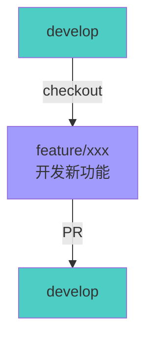
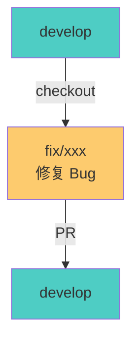
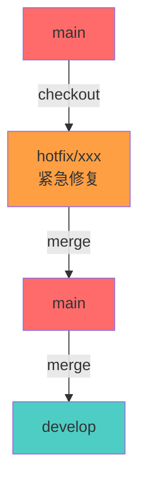
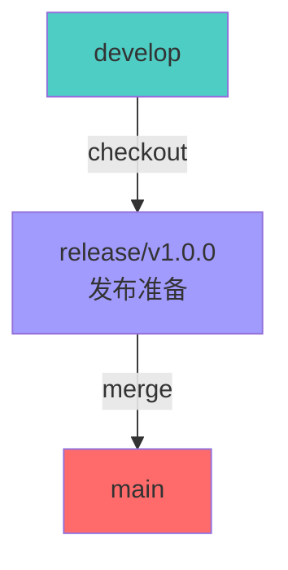
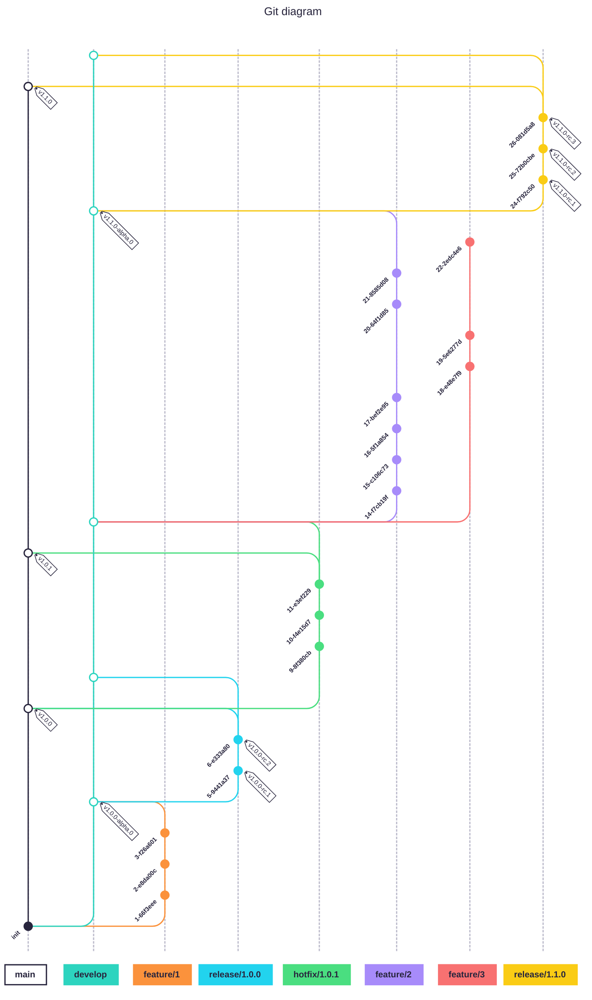

# 团队 Git 协作规范

本文档定义了 LuLab Backend 项目的 Git 协作规范，包括分支管理、提交规范、Pull Request 流程、代码审查等内容，确保团队协作的高效性和代码质量。

## 📋 目录

- [分支管理策略](#分支管理策略)
- [提交信息规范](#提交信息规范)
- [Pull Request 流程](#pull-request-流程)
- [代码审查规范](#代码审查规范)
- [冲突解决](#冲突解决)
- [发布流程](#发布流程)
- [团队协作最佳实践](#团队协作最佳实践)

## 🌿 分支管理策略

### 分支类型

| 分支类型          | 命名规范                  | 用途                         | 生命周期 |
| ----------------- | ------------------------- | ---------------------------- | -------- |
| **main**    | `main`                  | 生产环境代码，始终保持稳定   | 永久     |
| **develop** | `develop`               | 开发主分支，集成所有功能开发 | 永久     |
| **feature** | `feature/<description>` | 新功能开发                   | 临时     |
| **fix**     | `fix/<description>`     | Bug 修复                     | 临时     |
| **hotfix**  | `hotfix/<description>`  | 生产环境紧急修复             | 临时     |
| **release** | `release/<version>`     | 版本发布准备                 | 临时     |

### 分支命名示例

```bash
# 功能开发分支
feature/user-authentication
feature/meeting-recording
feature/email-notification

# Bug 修复分支
fix/login-timeout-error
fix/timezone-issue
fix/database-connection-pool

# 紧急修复分支
hotfix/security-vulnerability
hotfix-critical-bug

# 发布分支
release/v1.0.0
release/v1.1.0
```

### 分支工作流程

#### 1. 功能开发流程



**步骤**:

1. 从 `develop` 分支创建新的功能分支
2. 在功能分支上进行开发和测试
3. 提交 Pull Request 到 `develop` 分支
4. 通过代码审查后合并到 `develop`
5. 删除已合并的功能分支

**功能分支同步 develop 进展**:

在开发过程中，如果 `develop` 分支被其他开发者推进了很多个提交，你的 feature 分支会落后于 `develop`。这种情况下，需要在提交 PR 前将 feature 分支与最新的 develop 同步。

**推荐方法：使用 Rebase**

```bash
# 1. 切换到你的 feature 分支
git checkout feature/xxx

# 2. 拉取最新的 develop 代码
git fetch origin develop

# 3. 将 feature 分支变基到最新的 develop 上
git rebase origin/develop

# 4. 如果有冲突，解决冲突后继续
git add <冲突文件>
git rebase --continue

# 5. 强制推送到远程（因为 rebase 改变了历史）
git push -f origin feature/xxx
```

**优点**:
- 保持提交历史清晰，呈线性
- 避免不必要的合并提交

**缺点**:
- 改变了提交历史，需要强制推送
- 如果多人协作同一个 feature 分支，会造成问题

**替代方法：使用 Merge**

```bash
# 1. 切换到你的 feature 分支
git checkout feature/xxx

# 2. 拉取最新的 develop 代码
git fetch origin develop

# 3. 合并最新的 develop 到 feature 分支
git merge origin/develop

# 4. 如果有冲突，解决冲突后提交
git add <冲突文件>
git commit -m "merge: sync with develop"

# 5. 推送到远程
git push origin feature/xxx
```

**适用场景**:
- feature 分支已经推送到远程
- 多人协作同一个 feature 分支
- 不希望改变提交历史

**最佳实践建议**:

1. **频繁同步**: 每天至少同步一次 develop 分支
   ```bash
   git fetch origin develop
   git rebase origin/develop
   ```

2. **小步提交**: 频繁提交小的变更，减少冲突范围

3. **及时沟通**: 如果 develop 有重大变更，及时与团队沟通

4. **定期更新 PR**: 保持 PR 与 develop 同步，减少最终合并时的冲突

**冲突解决技巧**:

```bash
# 1. 查看冲突文件
git status

# 2. 使用 VS Code 或其他工具解决冲突
code .

# 3. 标记冲突已解决
git add <冲突文件>

# 4. 继续 rebase 或 merge
git rebase --continue    # 如果是 rebase
# 或
git commit               # 如果是 merge

# 5. 如果想放弃，可以中止
git rebase --abort       # 放弃 rebase
# 或
git merge --abort        # 放弃 merge
```

#### 2. Bug 修复流程



**步骤**:

1. 从 `develop` 分支创建修复分支
2. 修复 Bug 并添加测试用例
3. 提交 Pull Request 到 `develop` 分支
4. 通过代码审查后合并到 `develop`
5. 删除已合并的修复分支

#### 3. 紧急修复流程



**步骤**:

1. 从 `main` 分支创建 hotfix 分支
2. 快速修复问题并测试
3. 合并到 `main` 分支并打标签
4. 合并回 `develop` 分支
5. 删除 hotfix 分支

**详细命令**:

```bash
# 1. 从 main 分支创建 hotfix 分支
git checkout main
git pull origin main
git checkout -b hotfix/1.0.1

# 2. 修复问题并提交
git add .
git commit -m "fix: resolve critical security issue"

# 3. 合并到 main（使用 --no-ff 保留分支边界，方便审计）
git checkout main
git merge --no-ff hotfix/1.0.1

# 打标签
git tag -a v1.0.1 -m "Hotfix version 1.0.1"

# 推送到远程
git push origin main
git push origin v1.0.1

# 4. 合并回 develop（使用 --no-ff 保留分支边界）
git checkout develop
git merge --no-ff hotfix/1.0.1

# 推送到远程
git push origin develop

# 5. 删除 hotfix 分支
git branch -d hotfix/1.0.1
git push origin --delete hotfix/1.0.1
```

#### 4. 发布流程



**步骤**:

1. 从 `develop` 分支创建 release 分支
2. 进行最后的测试和文档更新
3. 更新版本号
4. 合并到 `main` 分支并打标签
5. 合并回 `develop` 分支
6. 删除 release 分支

### 分支保护规则

| 分支                  | 保护规则    | 说明                                                       |
| --------------------- | ----------- | ---------------------------------------------------------- |
| **main**        | 🔒 严格保护 | 禁止直接推送，必须通过 Pull Request，需要至少 1 个审查批准 |
| **develop**     | 🔒 严格保护 | 禁止直接推送，必须通过 Pull Request，需要至少 1 个审查批准 |
| **feature/fix** | 🔓 无保护   | 开发者可以直接推送                                         |

### 完整工作流程示例

以下是一个完整的 Git 工作流程示例，展示了从初始化到多次发布和 hotfix 的完整流程：



**流程说明**:

1. **初始化**: 创建初始提交和 develop 分支
2. **feature/1**: 开发第一个功能，合并到 develop 并打 alpha 标签
3. **release/1.0.0**: 创建发布分支，进行 RC 测试，最终发布 v1.0.0
4. **hotfix/1.0.1**: 从 main 创建 hotfix 分支，修复紧急问题并发布 v1.0.1
5. **feature/2 和 feature/3**: 并行开发多个功能
6. **release/1.1.0**: 准备 v1.1.0 版本发布

## ✍️ 提交信息规范

### Conventional Commits 规范

我们遵循 [Conventional Commits](https://www.conventionalcommits.org/) 规范，提交信息格式如下：

```
<type>(<scope>): <subject>

<body>

<footer>
```

### 提交类型 (type)

| 类型               | 说明                         | 示例                                                   |
| ------------------ | ---------------------------- | ------------------------------------------------------ |
| **feat**     | 新功能                       | `feat(auth): add JWT token refresh endpoint`         |
| **fix**      | Bug 修复                     | `fix(meeting): resolve timezone issue in scheduling` |
| **docs**     | 文档变更                     | `docs(api): update Swagger documentation`            |
| **style**    | 代码格式（不影响功能）       | `style: format code with Prettier`                   |
| **refactor** | 重构（不是新功能也不是修复） | `refactor(user): simplify user validation logic`     |
| **perf**     | 性能优化                     | `perf(database): add index for user queries`         |
| **test**     | 测试相关                     | `test(auth): add unit tests for login`               |
| **chore**    | 构建过程或辅助工具的变动     | `chore: update dependencies`                         |
| **ci**       | CI 配置文件和脚本的变动      | `ci: add GitHub Actions workflow`                    |
| **revert**   | 回滚之前的提交               | `revert: feat(auth): remove deprecated endpoint`     |

### 提交范围 (scope)

范围用于标识提交影响的模块或组件：

| 范围                | 说明           |
| ------------------- | -------------- |
| `auth`            | 认证和授权模块 |
| `user`            | 用户管理模块   |
| `meeting`         | 会议管理模块   |
| `verification`    | 验证码模块     |
| `mail`            | 邮件服务模块   |
| `tencent-meeting` | 腾讯会议集成   |
| `lark-meeting`    | 飞书集成       |
| `database`        | 数据库相关     |
| `api`             | API 接口       |
| `config`          | 配置相关       |
| `common`          | 通用模块       |

### 提交信息示例

#### ✅ 好的提交信息

```bash
# 功能添加
feat(auth): add JWT token refresh endpoint

Implement token refresh mechanism to allow users to obtain
new access tokens using refresh tokens.

- Add refresh token rotation
- Implement token blacklist for logout
- Add refresh endpoint validation

Closes #123

# Bug 修复
fix(meeting): resolve timezone issue in meeting scheduling

Fix incorrect timezone conversion when creating meetings.
Use UTC as the base timezone and convert to user's timezone
when displaying.

Fixes #456

# 文档更新
docs(api): update Swagger documentation for user endpoints

Add request/response examples and update parameter descriptions
for all user-related endpoints.

# 重构
refactor(user): simplify user validation logic

Extract common validation logic into a shared validator class
to reduce code duplication.

# 性能优化
perf(database): add index for user queries

Add composite index on (email, status) to improve query performance
for user lookup operations.
```

#### ❌ 不好的提交信息

```bash
# 太简单
fix bug
update
add feature

# 太长
fix the bug where the user cannot login when the timezone is not set correctly and the email contains special characters

# 不符合规范
added login feature
fixed the meeting issue
update docs
```

### 提交信息最佳实践

1. **使用祈使句**: "add feature" 而不是 "added feature" 或 "adds feature"
2. **首字母小写**: "add feature" 而不是 "Add feature"
3. **句末不加句号**: subject 行末尾不要加句号
4. **限制 subject 长度**: subject 不超过 50 个字符
5. **详细描述 body**: body 部分行长度不超过 72 个字符
6. **引用 Issue**: 在 footer 中使用 `Closes #123` 或 `Fixes #456`
7. **一次提交一个变更**: 每个提交只做一件事，便于代码审查和回滚

## 🔀 Pull Request 流程

### Pull Request 创建流程

#### 1. 创建功能分支

```bash
# 确保本地 develop 分支是最新的
git checkout develop
git pull origin develop

# 创建新的功能分支
git checkout -b feature/user-authentication

# 进行开发和提交
git add .
git commit -m "feat(auth): add user authentication with JWT"

# 推送到远程仓库
git push -u origin feature/user-authentication
```

#### 2. 创建 Pull Request

在 GitHub/GitLab 上创建 Pull Request：

**PR 标题格式**: `<type>(<scope>): <subject>`

**PR 描述模板**:

```markdown
## 📝 变更描述
简要描述本次 PR 的变更内容。

## 🎯 变更类型
- [ ] 新功能 (feature)
- [ ] Bug 修复 (fix)
- [ ] 代码重构 (refactor)
- [ ] 文档更新 (docs)
- [ ] 性能优化 (perf)
- [ ] 测试相关 (test)
- [ ] 其他 (chore)

## 📋 变更内容
- 变更点 1
- 变更点 2
- 变更点 3

## 🧪 测试
- [ ] 单元测试已通过
- [ ] 集成测试已通过
- [ ] 手动测试已完成

## 📸 截图（如果适用）
如有 UI 变更，请提供截图。

## 🔗 相关 Issue
Closes #123

## ✅ 检查清单
- [ ] 代码符合项目规范
- [ ] 已添加必要的测试
- [ ] 已更新相关文档
- [ ] 已通过 ESLint 检查
- [ ] 已通过 TypeScript 类型检查
- [ ] 已通过所有测试
```

### Pull Request 审查流程

#### 1. 自动检查

PR 创建后，会自动运行以下检查：

| 检查项             | 说明                | 要求        |
| ------------------ | ------------------- | ----------- |
| **CI 构建**  | 编译项目            | ✅ 必须通过 |
| **代码检查** | ESLint 检查         | ✅ 必须通过 |
| **类型检查** | TypeScript 类型检查 | ✅ 必须通过 |
| **单元测试** | 运行单元测试        | ✅ 必须通过 |
| **集成测试** | 运行集成测试        | ✅ 必须通过 |

#### 2. 代码审查

**审查者职责**:

- 检查代码质量和可读性
- 验证功能实现是否符合需求
- 检查是否有安全漏洞
- 确保测试覆盖充分
- 验证文档是否更新

**审查反馈类型**:

- **Approve**: 代码可以合并
- **Request Changes**: 需要修改后重新审查
- **Comment**: 仅提供建议，不阻止合并

#### 3. 审查标准

| 审查项               | 标准                            |
| -------------------- | ------------------------------- |
| **代码质量**   | 代码清晰、可读、符合规范        |
| **功能正确性** | 实现符合需求，无逻辑错误        |
| **测试覆盖**   | 有充分的测试用例，覆盖主要场景  |
| **文档完整性** | API 文档、注释、README 等已更新 |
| **安全性**     | 无安全漏洞，敏感信息已保护      |
| **性能影响**   | 无明显的性能问题                |
| **向后兼容性** | 不破坏现有功能                  |

### Pull Request 合并策略

| 策略                       | 适用场景                  | 说明                                     |
| -------------------------- | ------------------------- | ---------------------------------------- |
| **Squash and merge** | 功能分支、修复分支        | 将多个提交合并为一个，保持主分支历史清晰 |
| **Merge commit**     | Release 分支、Hotfix 分支 | 保留完整的提交历史，便于追踪             |
| **Rebase and merge** | 不推荐使用                | 可能导致提交历史混乱                     |

**推荐**: 对于功能分支和修复分支，使用 `Squash and merge` 策略。

**注意**: 对于 `release/*` → `main` 和 `hotfix/*` → `main/develop` 的合并，应使用 `--no-ff` (no fast-forward) merge，以保留分支边界，方便审计。

### Pull Request 合并后操作

```bash
# 删除本地分支
git branch -d feature/user-authentication

# 删除远程分支（GitHub/GitLab 会自动提示）
git push origin --delete feature/user-authentication

# 更新本地 develop 分支
git checkout develop
git pull origin develop
```

## 👥 代码审查规范

### 审查者行为准则

#### ✅ 应该做的

1. **及时响应**: 在 24 小时内审查分配的 PR
2. **提供建设性反馈**: 具体说明问题和改进建议
3. **认可优秀代码**: 对好的实现给予正面反馈
4. **关注重点**: 优先关注功能正确性、安全性和性能
5. **尊重作者**: 保持礼貌和专业的态度

#### ❌ 不应该做的

1. **不要拖延**: 避免长时间不审查 PR
2. **不要过于苛刻**: 避免对非关键问题吹毛求疵
3. **不要忽略**: 不要只看表面，要深入理解代码逻辑
4. **不要盲目批准**: 未经仔细审查就批准 PR
5. **不要人身攻击**: 对事不对人，避免负面评价

### 审查检查清单

#### 代码质量

- [ ] 代码结构清晰，易于理解
- [ ] 变量和函数命名准确、有意义
- [ ] 遵循项目代码规范
- [ ] 无重复代码，已提取公共逻辑
- [ ] 适当的注释说明复杂逻辑

#### 功能正确性

- [ ] 实现符合需求和设计
- [ ] 边界条件已处理
- [ ] 错误处理完善
- [ ] 无逻辑错误

#### 测试覆盖

- [ ] 有充分的单元测试
- [ ] 有必要的集成测试
- [ ] 测试用例覆盖主要场景
- [ ] 测试命名清晰，易于理解

#### 文档完整性

- [ ] API 文档已更新（Swagger）
- [ ] README 已更新（如有需要）
- [ ] 代码注释充分
- [ ] 变更日志已记录

#### 安全性

- [ ] 无 SQL 注入风险
- [ ] 无 XSS 攻击风险
- [ ] 敏感信息已保护
- [ ] 权限控制正确

#### 性能影响

- [ ] 无明显的性能问题
- [ ] 数据库查询已优化
- [ ] 无内存泄漏风险
- [ ] 适当的缓存策略

### 审查反馈示例

#### ✅ 建设性反馈

```markdown
**代码质量**
- 建议将 `getUserById` 函数提取到 `UserService` 中，避免在控制器中直接访问数据库
- 变量名 `data` 太泛化，建议改为更具体的名称，如 `userProfile`

**功能正确性**
- 在 `validateEmail` 函数中，没有处理 `null` 或 `undefined` 的情况，建议添加空值检查

**测试覆盖**
- 建议添加测试用例验证当用户不存在时的行为

**安全性**
- `password` 字段在响应中不应该返回，建议使用 DTO 进行过滤
```

#### ❌ 不好的反馈

```markdown
代码写得很差，重写吧。
这里有问题，自己改。
```

## ⚔️ 冲突解决

### 冲突产生的原因

1. **多人修改同一文件**: 多个开发者同时修改同一文件的相同部分
2. **分支合并**: 分支落后于主分支，合并时产生冲突
3. **变基操作**: rebase 操作时产生冲突

### 冲突解决步骤

#### 1. 识别冲突

```bash
# 拉取最新代码
git pull origin develop

# 如果有冲突，Git 会提示
CONFLICT (content): Merge conflict in src/auth/auth.service.ts
```

#### 2. 查看冲突文件

```bash
# 查看冲突文件
git status

# 打开冲突文件，会看到冲突标记
<<<<<<< HEAD
当前分支的代码
=======
要合并分支的代码
>>>>>>> feature/user-authentication
```

#### 3. 解决冲突

手动编辑冲突文件，选择正确的代码：

```typescript
// 解决冲突后的代码
async validateUser(email: string, password: string): Promise<boolean> {
  const user = await this.userRepository.findByEmail(email);
  if (!user) {
    return false;
  }
  return await bcrypt.compare(password, user.password);
}
```

#### 4. 标记冲突已解决

```bash
# 标记冲突已解决
git add src/auth/auth.service.ts

# 提交合并
git commit -m "resolve conflicts in auth.service.ts"

# 推送到远程
git push origin feature/user-authentication
```

### 冲突解决最佳实践

1. **频繁同步**: 定期从主分支拉取最新代码，减少冲突
2. **小步提交**: 频繁提交小的变更，减少冲突范围
3. **及时沟通**: 与相关开发者沟通，协商冲突解决方案
4. **使用工具**: 使用 Git GUI 工具（如 VS Code 的 Git 扩展）帮助解决冲突
5. **测试验证**: 解决冲突后，务必运行测试确保功能正常

## 🚀 发布流程

### 版本号规范

遵循 [Semantic Versioning](https://semver.org/) 规范：

```
MAJOR.MINOR.PATCH
```

| 版本号          | 说明                 | 示例      |
| --------------- | -------------------- | --------- |
| **MAJOR** | 不兼容的 API 变更    | `2.0.0` |
| **MINOR** | 向后兼容的功能性新增 | `1.1.0` |
| **PATCH** | 向后兼容的问题修正   | `1.0.1` |

### 发布步骤

#### 1. 准备发布

```bash
# 确保 develop 分支是最新的
git checkout develop
git pull origin develop

# 创建 release 分支
git checkout -b release/v1.0.0

# 更新版本号
# 编辑 package.json
{
  "version": "1.0.0"
}

# 提交版本号变更
git add package.json
git commit -m "chore(release): bump version to 1.0.0"
```

#### 2. 测试和验证

```bash
# 运行所有测试
pnpm test:all

# 构建项目
pnpm build

# 验证构建产物
pnpm start:prod
```

#### 3. 合并到 main

```bash
# 合并到 main 分支（使用 --no-ff 保留分支边界，方便审计）
git checkout main
git merge --no-ff release/v1.0.0

# 打标签
git tag -a v1.0.0 -m "Release version 1.0.0"

# 推送到远程
git push origin main
git push origin v1.0.0
```

#### 4. 合并回 develop

```bash
# 合并回 develop 分支（使用 --no-ff 保留分支边界）
git checkout develop
git merge --no-ff release/v1.0.0

# 推送到远程
git push origin develop

# 删除 release 分支
git branch -d release/v1.0.0
git push origin --delete release/v1.0.0
```

### 发布检查清单

- [ ] 所有测试通过
- [ ] 代码审查完成
- [ ] 文档已更新
- [ ] 变更日志已记录
- [ ] 版本号已更新
- [ ] 发布说明已准备
- [ ] 回滚计划已准备

## 🤝 团队协作最佳实践

### 日常开发流程

1. **开始工作前**:

   ```bash
   # 拉取最新代码
   git checkout develop
   git pull origin develop

   # 创建功能分支
   git checkout -b feature/your-feature
   ```
2. **开发过程中**:

   ```bash
   # 频繁提交
   git add .
   git commit -m "feat(scope): add some feature"

   # 定期同步主分支
   git fetch origin
   git rebase origin/develop
   ```
3. **完成开发后**:

   ```bash
   # 推送到远程
   git push -u origin feature/your-feature

   # 创建 Pull Request
   ```

### 代码提交频率

- **小步提交**: 每完成一个小功能就提交，不要积累大量代码
- **原子提交**: 每个提交只做一件事，便于审查和回滚
- **频繁同步**: 每天至少从主分支同步一次代码

### 沟通协作

1. **任务分配**: 在项目管理工具（如 Jira、GitHub Issues）上分配任务
2. **进度同步**: 定期同步开发进度，避免重复工作
3. **代码审查**: 及时审查他人的 PR，不要阻塞开发流程
4. **问题讨论**: 遇到问题及时在团队频道讨论，寻求帮助

### 代码质量保证

1. **提交前检查**:

   ```bash
   # 运行代码检查
   pnpm lint

   # 运行测试
   pnpm test:unit

   # 格式化代码
   pnpm format
   ```
2. **代码审查**: 所有代码必须经过审查才能合并到主分支
3. **测试覆盖**: 新功能必须包含相应的测试用例
4. **文档更新**: API 变更必须更新相关文档

### 常见问题解决

#### 问题 1: Push 被拒绝

```bash
# 错误信息
! [rejected]        feature/xxx -> feature/xxx (non-fast-forward)

# 解决方案
git pull --rebase origin feature/xxx
git push origin feature/xxx
```

#### 问题 2: 提交信息写错了

```bash
# 修改最后一次提交信息
git commit --amend -m "correct commit message"

# 如果已推送，需要强制推送（谨慎使用）
git push --force-with-lease origin feature/xxx
```

#### 问题 3: 错误的提交到错误的分支

```bash
# 撤销最后一次提交（保留更改）
git reset --soft HEAD~1

# 切换到正确的分支
git checkout correct-branch

# 提交更改
git add .
git commit -m "correct commit message"
```

#### 问题 4: 需要合并多个提交

```bash
# 交互式变基最近 3 次提交
git rebase -i HEAD~3

# 将 'pick' 改为 'squash' 或 's' 来合并提交
# 保存并退出后，编辑合并后的提交信息
```

## 📚 参考资源

- [Conventional Commits](https://www.conventionalcommits.org/)
- [Semantic Versioning](https://semver.org/)
- [GitHub Flow](https://docs.github.com/en/get-started/quickstart/github-flow)
- [Git Flow](https://nvie.com/posts/a-successful-git-branching-model/)
- [Git Documentation](https://git-scm.com/doc)

## 📝 变更日志

| 日期       | 版本  | 变更内容                            | 作者 |
| ---------- | ----- | ----------------------------------- | ---- |
| 2025-12-28 | 1.0.0 | 初始版本，创建团队 Git 协作规范文档 | Team |

---

**注意**: 本文档是团队协作的重要规范，所有团队成员都应该熟悉并遵守。如有疑问或建议，请在团队会议上讨论。
